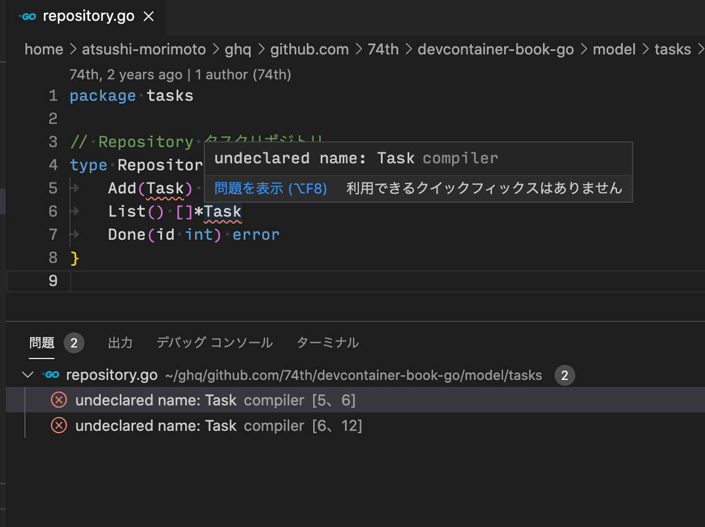
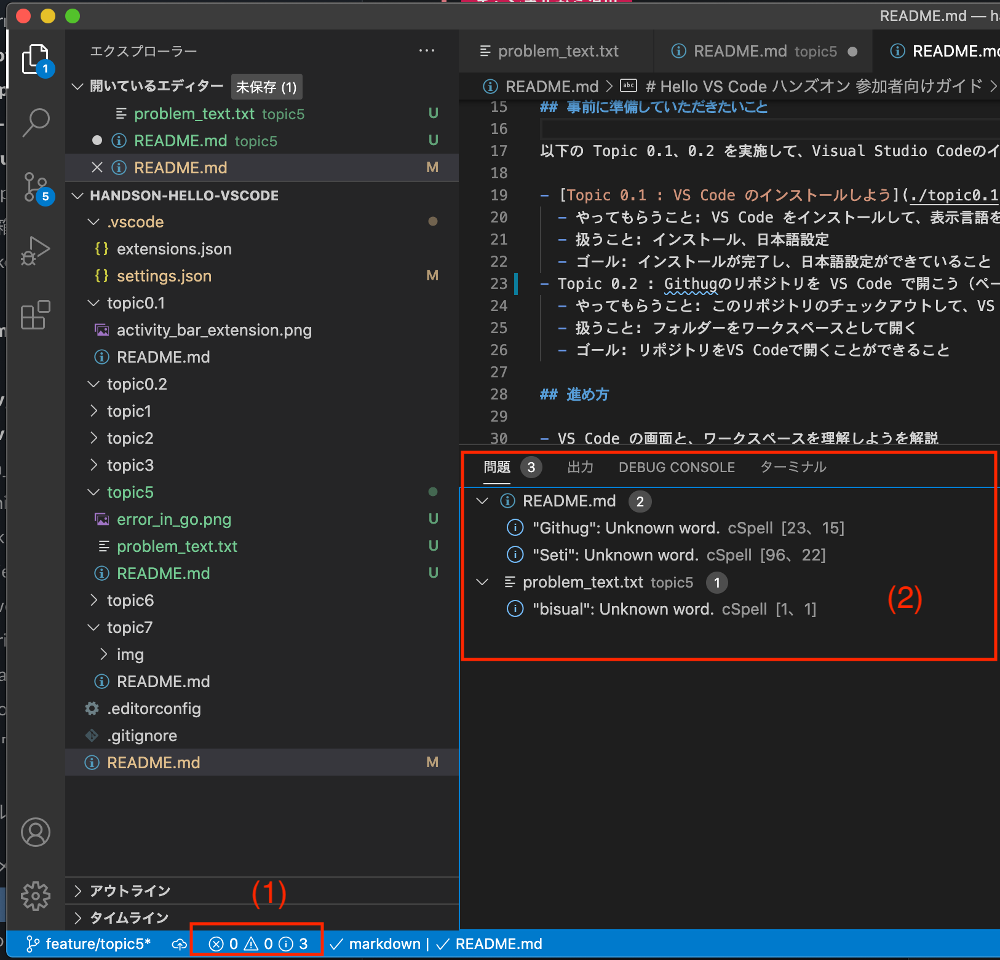
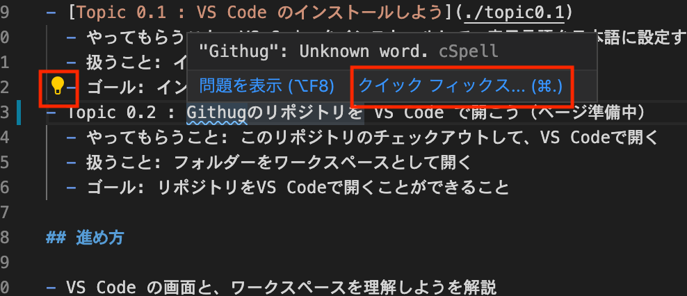
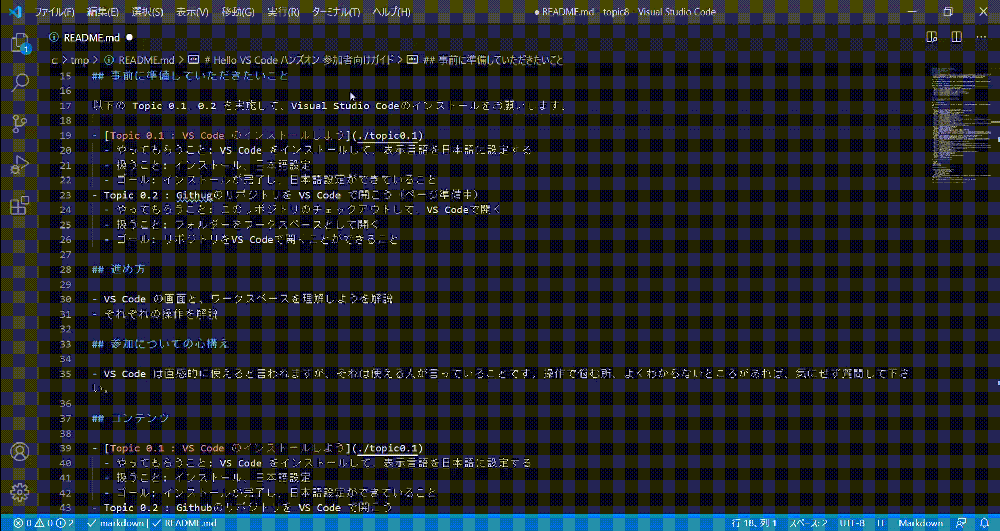
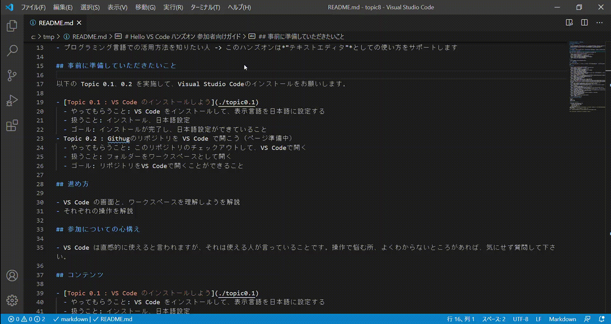

# 拡張機能をインストールして、Markdown をチェックさせよう

## リンターでチェックして、問題を問題パネルで見つけよう

VS Code では、コードやテキストを検査して、コンパイルエラーなどの問題を表示する機能があります。
問題パネルや、ソースコード中の下線で表示され、ソースコード中ではその箇所にマウスカーソルを当てるとポップアップで問題の内容が表示されます。



検出された問題には 3 段階のレベル「エラー（赤）」「警告（緑）」「情報（青）」があります。このレベルはアイコンと色で表現されます。



ステータスバー中には問題の数が表示(1)され、左から「エラーの数」「警告の数」「情報の数」になっています。
また、(1)をクリックすると、問題パネル(2)が表示されます。
問題を一覧したり、フィルターを掛けて確認することができます。
問題パネル中の問題をクリックすると、エディタ中で開くことができます。

多くのリンター（エラーチェックツール）は、そのリンターを VS Code で使えるようにする拡張機能が作られています。
例えば、JavaScript のリンター ESLint の場合、ESLint という拡張機能で VS Code 上で実行できるようになっています。
使いたいリンターがある場合、その名前で拡張機能を検索してみると良いでしょう。

汎用的に英単語のスペルミスをチェックする拡張機能 Code Spell Checker があります。


この拡張機能を使うと、開いているファイルに限り英単語のスペルミスがチェックされます。

注意: 問題パネルに表示する機能は、拡張機能によって表示される範囲が異なります。多くのコンパイラでは、ワークスペース全体のコンパイルエラーが表示され、今開いていないファイルのエラーも発見することができますが、リンターの中では表示しているファイルのみをチェック対象にしているものがあります（Code Spell Checker は、開いているファイルのみを検査します）。

## 問題をクイックフィックスで修正しよう

リンターで検出された問題には、リンターによっては自動で修正することができるものもあります。
問題に対応した修正を行う機能をクイックフィックスと呼びます。

クイックフィックスが利用できる場合、カーソルの近くに 💡 アイコンが表示されたり、問題の場所にマウスポインタを当てた時に表示されるポップアップにクイックフィックスのボタンが表示されます。





問題パネルでは、アイコンにマウスポインタを当てた時に 💡 アイコンが表示されます。

💡 アイコンをクリックすると、クイックフィックスの内容のリストが表示されます。
この中から選択すると、そのクイックフィックスが適用されます。



### Advanced Tips キーボードショートカットを活用する

問題の箇所を次々と修正したい場合、キーボードショートカットを使うと、手早くすることができます。

- 次の問題へ移動 F8
- 前の問題へ移動 Shift + F8
- カーソルの位置のクイックフィックスを表示 macOS: Cmd+. Windows・Linux: Ctrl+.

## 課題 1

拡張機能 Code Spell Checker をインストールしてください。

これまでの課題で作成したマークダウン、もしくは、topic5/README.md を表示し、スペルミスが無いかどうかをチェックしてみてください。
スペルミスがない場合にも、試しに誤ったスペルを入力して、表示されることを確認してください。

ただし、Code Spell Checker はエディタで開いているファイルのみをチェックします。
一度エクスプローラービューからファイルを開いてください。

```markdown
# スペルミスしているテキスト

- Bisual Studio Code
- Visual Studio Vode
```

以下の 3 つを確認してください。

- ステータスバー中に、問題の数の数字が増えていること
- 問題パネルでスペルミスが"Unknown word"と表示されること
- 問題パネルのスペルミスをクリックすると、スペルミスの行がエディター中に表示されること。

## 課題 2

Code Spell Checker のクイックフィックスを使って、スペルミスを修正してみてください。

## 課題 3

Code Spell Checker では、新しい単語をクイックフィックスから登録することができます。
単語 quickfix は Unknown word と、スペルミスと判断されてしまいます。
単語 quickfix でクイックフィックスを表示し、"Add: "quickfix" to user dictionary" を選び、単語として追加してください。

追加した後は、単語 quickfix に表示されていた波線や、問題パネル中の表示が消えていることを確認してください。

なお、追加した単語はユーザ設定の "C Spell: User Words"に"quickfix" に追加されます。
ユーザ設定の開き方については、Topic 7 を参照してください。


