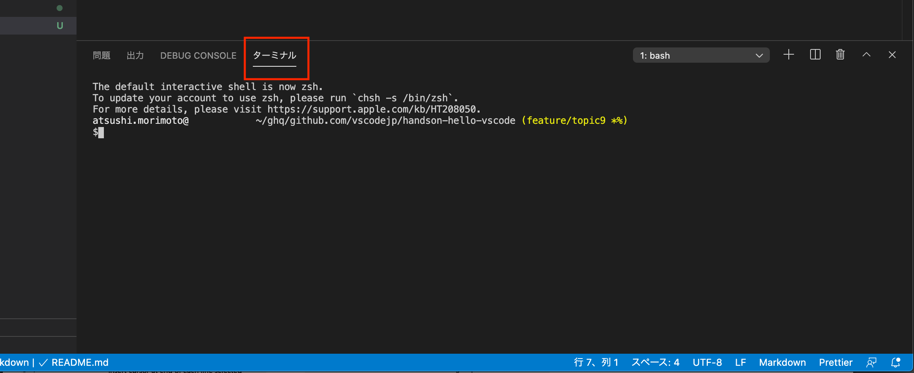

# Topic 9 : ターミナルを活用しよう

VS Code には 統合ターミナル と呼ばれるターミナル機能が付属しています。
デバッグ実行時のコマンド、タスクのコマンドなどはこのターミナルを使って実行されます。
利用するには、パネルのタブを "ターミナル" に切り替えます。



パネルが開かれていない場合には、ターミナルを表示/非表示を切り替えるキーボードショートカット macOS: `Cmd+@` `` Cmd+` ``、Windows・Linux: `Ctrl+@ `　を使って開くことができます（英語キーボードの場合、macOS: `` Cmd+` ``、Windows・Linux `` Ctrl+` ``）。
もしくは、パネルの表示/非表示を切り替えるキーボードショートカット macOS: `Cmd+j`、Windows・Linux: `Ctrl+j` を覚えていると、パネルが使いやすくなります。

Windows では PowerShell 、macOS・Linux では bash が使われます（この利用するシェルは設定の "Terminal>Integrated>Shell:(OS)" から変更できます）。

ターミナルの中では、他のターミナルと同様に、様々な CLI のツールを使うことができます。
コンパイラをターミナルで実行する時、コンパイルエラーの箇所のファイルパスと行数をコンパイラが出力することがあります。
VS Code では、いくつかのパターンでは出力のファイルパスや行数を認識し、macOS: Cmd を押しながら、Windows・Linux: Ctrl を押しながらマウスカーソルを当てると下線がつき、さらにボタンを押しながらクリックすると、そのファイルと行数をエディターで瞬時に開いてくれます。


また、ターミナルは同時に複数開くこともできます。


- (1) ターミナルの切り替え
- (2) 新しいターミナルを開く
- (3) 新しいターミナルを横に分割して開く
- (4) ターミナルを閉じる

また、ターミナルの中では、code コマンドを使うことができます。
code コマンドの引数にファイルパスを指定した場合、そのファイルをエディターで開くことができます。

## 課題 1

ターミナルを開き、topic9 のフォルダーに移動してください。

```
$ cd topic9
```

topic9 のフォルダーには、task.zip という ZIP ファイルが置かれています。
以下のコマンドをターミナル上で実行し、ファイルを解凍してください。

Windows(PowerShell) の場合

```
> Expand-Archive task.zip
> ls task
```

macOS・Linux の場合

```
$ unzip task.zip
```

macOS・Linux の場合、解凍時にターミナル上にファイルパスが表示されます。
Power Shell の場合、解凍時にはファイルのリストは表示されないため、解凍したファイルを格納したフォルダーのファイルリストを表示するコマンド`ls task`を実行してください。

ターミナル上に表示されたファイルパスをクリックして、そのファイルをエディターで表示してください。

**Windows での実行**


## 課題 2

topic9 フォルダーにある try-code-command.md を code コマンドの引数に設定して、エディターで開いてください。

```
$ cd topic9
$ code try-code-command.md
```
